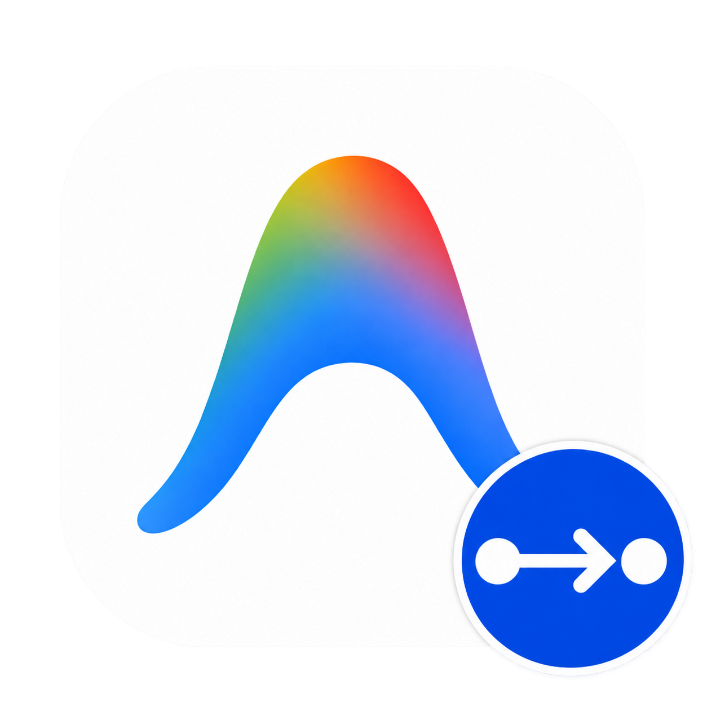
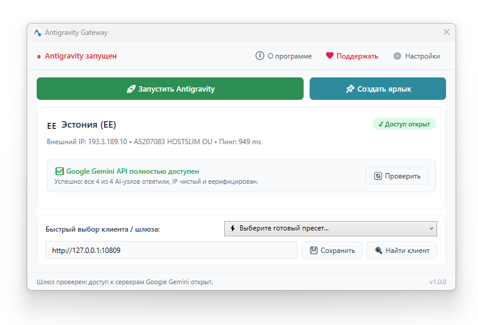

# Antigravity в России с любым (Защищённым соединением): стабильное соединение без разрывов и ошибок 400

[Русский](README.md) | [English](README.en.md)

**Antigravity Gateway** — это лаунчер для запуска Antigravity через ВАШЕ любое удобное вам защищённое соединение (Happ, Hiddify, v2ray, Xray, Clash, Nekoray, Sing-box, AdGuard, WireGuard и др.), обеспечивая стабильное соединение без разрывов и ошибок 400.

**Версия:** 1.0.0  
**Автор:** [CodoMagia](https://github.com/codomagia)  
**Поддержать автора:** [Boosty](https://boosty.to/codomagia/donate)

Готовые сборки доступны во вкладке [Releases](https://github.com/codomagia/Antigravity-Gateway/releases).

---

## Внешний вид

---

### Почему работает только этот способ?

Потому что Antigravity намеренно не хочет использовать (Защищённое соединение), данный лаунчер учит Antigravity ходить в интернет через (Защищённое соединение).

### Почему стоит использовать этот лаунчер, ведь есть и другие?

- Потому что он **НЕ** модифицирует файлы Antigravity или какие-либо другие.
- Также после запуска Antigravity лаунчер сразу закрывается и не потребляет ОЗУ.
- Антивирусы при таком способе не дают ложных срабатываний, вам не придётся добавлять лаунчер в исключения антивируса.
- **Изоляция трафика:** через защищённое соединение направляется исключительно Antigravity, а браузеры и другие программы работают напрямую на полной скорости.

---

### Главные возможности:

- **Автопоиск в 1 клик** — мгновенно определяет запущенный прокси-клиент или системное защищённое подключение.
- **Ярлык на Рабочем столе со Splash-проверкой** — перед стартом проверяет шлюз: если всё готово — сразу запускает Antigravity; если канал выключен — подскажет включить защищённое соединение.
- **Экспресс-диагностика** — проверка задержки (ping), проверка доступности серверов Google Gemini и защита от сбоев.

---

### Быстрый старт:

1. Скачайте архив `Antigravity-Gateway-1.0.0.zip` в разделе [Releases](https://github.com/codomagia/Antigravity-Gateway/releases/latest).
2. Распакуйте архив в постоянную папку.
3. Запустите `Antigravity Gateway.exe`.
4. Нажмите **«🔍 Найти клиент»**, затем **«📌 Создать ярлык»**.

> **Примечание:** Установка не требуется. Не запускайте программу прямо из ZIP-архива.

---

## Системные требования

- **ОС:** Windows 10 или Windows 11 (x64)
- **Платформа:** .NET Framework 4.7.2 или новее (встроен в Windows 10/11)
- **Целевое приложение:** Google Antigravity (установленная версия или Portable)
- **Поддерживаемые клиенты:** Happ, Hiddify, Clash (Verge / Meta / Nyanpasu), Xray / V2Ray, Nekoray, Sing-box, AdGuard, WireGuard и любые SOCKS5 / HTTP прокси.

---

## Лицензия

Copyright © 2026 CodoMagia. Все права защищены.
